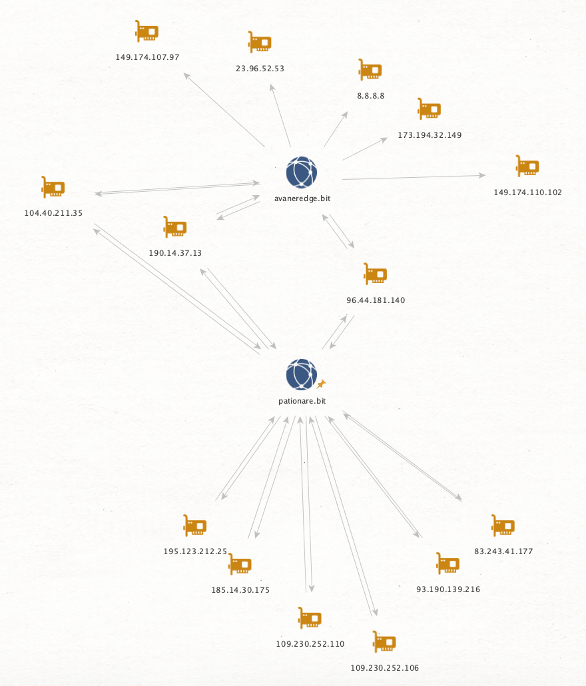

# Maltego Explorer of the (Emer|Name)coin name system

This Maltego transform is used to explore the domain and 
IP relations of the domain systems for Namecoin and Emercoin.
The queried SQL database includes both current and past relations, as the blockchain allows the viewing of historical values.

Example graph where the starting node was `pationare.bit`:

# Setup

## New export of Namecoin and Emercoin name system database

Make sure that `settings.py` has correct credentials for your Namecoin and Emercoin client and that you have enabled JSON RPC on them.
Change working directory to `export_code` and execute `export_main.py`.

## Maltego transform installation
Two transforms needs to installed, one for IP lookup and one for Domain lookup.

The maltego project filename is `maltego_project.py` and located in the root folder of the project. The class for IP transform is named `Blockchain_DNS_Transform_IP` and for Domain transform `Blockchain_DNS_Transform_Domain`.

With that, the installation part of [this Maltego documentation](https://docs.maltego.com/support/solutions/articles/15000017605-writing-local-transforms-in-python) should be enough to get through the installation.

## Dependencies

The dependencies in requirements.txt only need to be installed if a regenaration of the database will be done.

# Related research

The following paper and presentation by Kevin Perlow is a great intro into this research field:

* [Beating the Blockchain - Mapping Out Decentralized Namecoin and Emercoin Infrastructure](https://i.blackhat.com/us-18/Wed-August-8/us-18-Perlow-Beating-the-Blockchain-by-Mapping-Out_Decentralized_Namecoin-and-Emercoin-Infrastructure-wp.pdf)
* [https://www.youtube.com/watch?v=1iwsouV8ouQ](https://www.youtube.com/watch?v=1iwsouV8ouQ)

# Limitations

This project is more of a POC than an error-free product.
It should however be possible to use it in order to aid investigations of threat-actors utilizing the name system of Emercoin and Namecoin.
